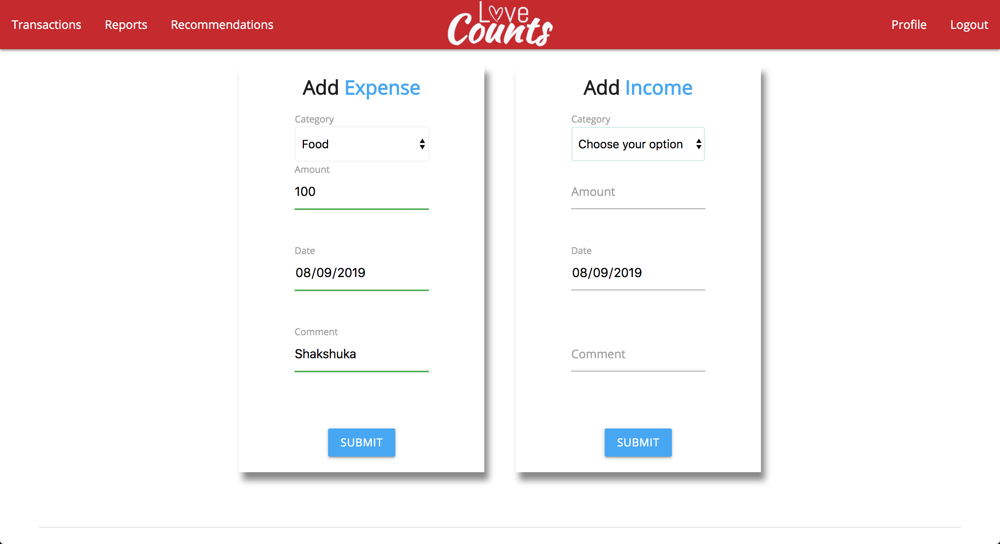

## loveCounts - Expense Tracker and Budget Planner for Couples

An app that helps couples set and meet financial goals.

### Built With:
- jQuery
- Handlebars
- Materialize
- Node.JS
- Express.js
- MongoDB
- Mongoose
- external API
- Charts.js npm package

### features:

- Add & Delete transaction
- Monthly Transactions List
- Current month's savings calculation
- Choose financial goals & receive recommendations on what you can spend with your savings.
  Recommendations offered will only be within budget limits.
- Bar Chart comparing monthly expenditures.
- Pie Chart showing current month's expenses divided by category.
- Alerts user when spending exceeds current balance.

###### User Profile

###### Current Month Pie Chart (By Category)

###### Monthly Comparison Bar Chart

###### Transactions List

###### Add Transaction
